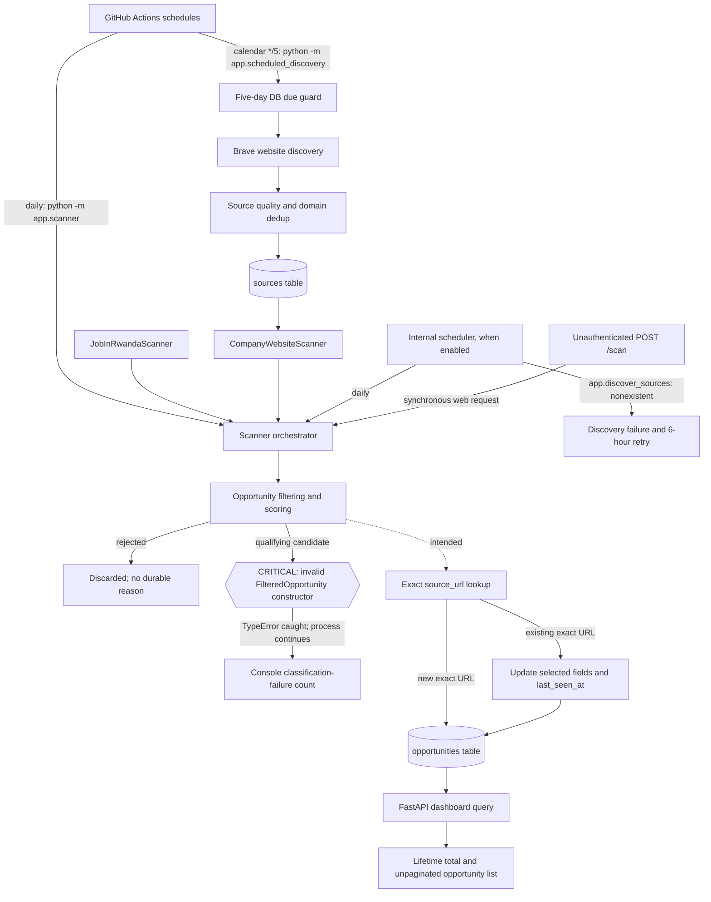

# Opportunity Radar Opportunity Acquisition Pipeline Audit

**Audit date:** 2026-08-04  
**Branch reviewed:** `global-saas-development`  
**Audit mode:** Static repository review plus read-only inspection of local operational artifacts and `opportunities.db`. No production service, production PostgreSQL database, GitHub Actions run history, secret, migration, scanner, or external website was accessed or executed.

## Executive conclusion

The acquisition pipeline is currently incapable of reliably publishing newly qualifying opportunities. Its most important defect is a known contract mismatch between `classify_opportunity()` and `FilteredOpportunity`: every candidate that passes the filter reaches an invalid constructor call, raises `TypeError`, is counted as a classification failure, and is discarded. `run_scanner()` catches those failures and returns normally, so GitHub Actions can report a successful run even when zero opportunities reach the database.

Several independent defects amplify that break:

- Website discovery can be delayed from five days to roughly ten days by combining a `*/5` calendar schedule with an exact five-day database guard.
- Discovery records success even when every Brave query failed.
- The local/internal scheduler invokes a module that does not exist; the checked-in log confirms repeated failures.
- Website HTTP failures are commonly converted into empty successful source scans, so health records say sources succeeded when they did not.
- Duplicate identity is only an exact URL string, while URL normalization differs across modules.
- The dashboard's headline total is a lifetime count that includes expired and undated records. It is not a freshness or currently actionable count.
- No durable scan-run, funnel, rejection, error, or freshness metrics exist. Most useful counts disappear with console logs.

These are not speculative edge cases. The ignored local runtime artifacts show a tender scan marked completed after 3,549.755 seconds, repeated discovery failures caused by `No module named app.discover_sources`, and a local database in which all 539 opportunities were first discovered on one day even though source scans continued afterward.

### Severity summary

| Severity | Count | Meaning in this audit |
|---|---:|---|
| Critical | 3 | Stops new opportunities or makes a completely failed acquisition run appear successful |
| High | 21 | Materially reduces freshness, coverage, correctness, or operational recoverability |
| Medium | 25 | Creates recurring false positives/negatives, scaling limits, misleading telemetry, or maintenance risk |
| Low | 5 | Quality, consistency, and operability defects with lower immediate business impact |

## Scope and evidence

The audit covered all 88 tracked files and the relevant ignored local runtime artifacts. In particular it traced:

- `.github/workflows/daily-tender-scan.yml`
- `.github/workflows/website-discovery.yml`
- `app/automation.py`, `app/internal_scheduler.py`, `app/jobs.py`, and `app/scheduled_discovery.py`
- both discovery implementations under `app/source_discovery.py` and `app/discovery/`
- source models, repository, quality, health, and seed logic
- `app/scanner.py`, both active scanner adapters, and their base class
- `app/filters.py` and `app/schemas.py`
- persistence models, database configuration, migration baseline, manual schema scripts, and schema-status tooling
- dashboard/detail/pipeline routes, templates, and static assets
- all tests and fixtures, including the strict expected-failure test documenting the classifier contract defect
- deployment/configuration files and architecture/planning documents
- `automation.log`, `automation_state.json`, and the local SQLite database in read-only mode

`app/api.py` and the placeholder crawler modules are empty. They contribute no alternative acquisition path. `current_backend_files.txt` is a tracked historical snapshot, not imported runtime code; it documents older scanner/model code and increases maintenance ambiguity but does not execute.

Production state remains unknown. GitHub Actions history and production PostgreSQL must be checked separately with explicit authorization. Local database figures below are evidence about this checkout only.

## End-to-end pipeline diagram

### Intended versus actual flow

| Transition | Intended | Actual stopping point |
|---|---|---|
| Actions → discovery | Discover source sites every five days | Timing guard can skip the next scheduled run; all-query failure can still be saved as success |
| Discovery → sources | Save high-confidence monitor URLs | One row per domain is effectively enforced; existing sources are silently auto-approved/reactivated |
| Sources → scanner | Crawl approved, active, due sources | Approval is forced; up to 500 sources and 30 pages each are processed sequentially; many HTTP failures look successful |
| Scanner → filter | Convert raw pages/listings to scored opportunities | Raw results reach filtering |
| Filter → duplicate detection | Return a flattened `FilteredOpportunity` | **All qualifying candidates raise `TypeError`; they do not reach deduplication** |
| Deduplication → database | Insert new or refresh existing | Only reachable if the contract defect is bypassed/fixed; identity is exact URL only |
| Database → dashboard | Show current actionable opportunities and health | Shows a lifetime total, includes expired/undated records, and exposes no ingestion freshness or failure state |

## Stage-by-stage operational audit

## 1. GitHub Actions

### How it works

- `daily-tender-scan.yml` schedules `python -m app.scanner` at `0 4 * * *` and permits manual dispatch.
- `website-discovery.yml` schedules `python -m app.scheduled_discovery` at `20 4 */5 * *` and permits manual dispatch.
- Both use Ubuntu, Python 3.12, pip caching, install `requirements.txt`, inject `DATABASE_URL` and `BRAVE_API_KEY`, disable the internal scheduler, allow one run per workflow concurrency group, and time out after 90 minutes.
- Scheduled workflows run from the repository's default branch. This development-branch audit does not prove the same revision is deployed or scheduled.

### Inputs

- Default-branch repository revision.
- GitHub schedule/manual dispatch event.
- `DATABASE_URL` and `BRAVE_API_KEY` repository secrets.
- GitHub-hosted runner, PyPI, external websites, Brave API, and database network availability.

### Outputs

- Ephemeral Actions logs and native job status/duration.
- Direct mutations to the configured database by the scanner/discovery commands.
- No application scan-run record, alert, report artifact, or independently verified opportunity delta.

### Stopping conditions

- Command exits.
- Runner reaches 90 minutes.
- Dependency installation, checkout, Python setup, or command step fails.
- Workflow concurrency serializes only other runs in the same workflow group.

### Failure conditions and hidden assumptions

- **Critical:** The scanner returns exit code 0 after scanner, classification, and save failures because it catches them and never raises based on totals.
- **High:** Discovery can return success with `failed_queries == 20`; `scheduled_discovery` then records the run as successful and suppresses discovery for five days.
- **High:** `*/5` is a calendar-day expression, not a durable “every 120 hours” interval. The workflow also enforces `last_success + 5 days`. Because success is recorded after work completes, the next nominal run exactly five days later is normally too early and skips; the effective cadence can become about ten days. Month boundaries add more variation.
- **High:** The two workflows have different concurrency groups, so discovery can change source rows while scanning reads/updates them. Internal/manual paths are outside both locks.
- **High:** A GitHub-hosted CI runner is trusted with the live database URL and writes directly to the operational database.
- **Medium:** A real local scan took 3,549.755 seconds (about 59 minutes). Growth, network slowness, or retries can cross the 90-minute hard timeout, leaving partial source and opportunity commits.
- **Medium:** Dependencies are version ranges rather than a lockfile; a new compatible release can change runtime behavior without an application code change.
- **Medium:** There is no migration/schema preflight. Runtime `create_all()`/DDL is expected to repair or create structures opportunistically.
- **Medium:** The `timezone` key is not validated in this repository. If unsupported by the active GitHub workflow schema, the schedule is invalid; if supported, documentation still conflicts about UTC versus Kigali time. This requires checking the live workflow validator/run history.
- **Low:** The deployment document says discovery starts daily at 04:15 UTC, while the tracked workflow says 04:20 on `*/5` days with an Africa/Kigali timezone field.

### Logging quality

Native step logs are available, and scanner output has human-readable summaries. Logs are unstructured, not retained in the application, have no run ID correlation, and contain no alerting threshold. A green job is not evidence of flow.

### Metrics collected

- GitHub native conclusion and duration.
- Console-only scan/discovery counts.
- No durable run status, candidates per stage, new-record delta, source coverage, rejection reasons, freshness, or SLA metric.

### Causes of stale counts

- Green runs with zero persisted opportunities.
- Discovery effectively running less often than intended.
- Default-branch workflow differing from the reviewed branch.
- Hard timeout after partial work.
- Missing/invalid secrets, schema drift, or provider failures that are swallowed downstream.

## 2. Website Discovery

### How it works

The production workflow calls `app.scheduled_discovery`, which creates/reads `automation_job_state`, checks the previous success timestamp, and calls `run_source_discovery()`. `RwandaSourceDiscovery` runs 20 fixed English/Rwanda Brave searches, requests up to 20 results per query, evaluates each result with `SourceQualityEvaluator`, accepts confidence scores of at least 60, and saves or improves a source.

A second implementation, `app.discovery.search_discovery`, is present but not used by the tracked production workflow. It uses 62 different queries, `BRAVE_SEARCH_API_KEY`, a different classifier, a threshold of 40, different URL normalization, and initially saves sources as unapproved. `app.automation` calls `app.source_discovery`, while `app.jobs` incorrectly calls `app.discover_sources`.

### Inputs

- Brave API key and network.
- Fixed English, Rwanda-specific query list.
- Brave's top 20 web results per query.
- Existing `sources` rows and database availability.
- Five-day timestamp in `automation_job_state`.

### Outputs

- New or updated `Source` rows.
- Console summary: results, candidates, added, existing, rejected, failed queries.
- A last-success timestamp even when all individual queries fail.

### Stopping conditions

- Twenty configured queries are attempted.
- Every result is evaluated.
- One-second sleep follows every query, including the last.
- A missing API key raises before the run.
- An uncaught database/result-processing exception aborts the job.
- The due guard returns 0 without discovery if the exact interval has not elapsed.

### Failure conditions and hidden assumptions

- **Critical:** Individual query exceptions are caught; the run returns a normal summary even when all 20 fail. The wrapper unconditionally records success.
- **High:** Two discovery engines disagree on key name, query set, minimum score, approval, classifier, and URL identity. Operators can run different systems unknowingly.
- **High:** The internal scheduler names `app.discover_sources`, which does not exist. `automation.log` records six repeated failures and `automation_state.json` retains the error.
- **High:** Domain-level deduplication (`monitor_url OR domain`) collapses all pages on one domain to one source. A better-scored URL can overwrite the monitored URL, causing other tender/career sections on the same organization site to disappear from coverage.
- **High:** Existing sources are automatically reactivated, approved, and cleared of auto-disable state when rediscovered. Discovery can undo a health/legal/operator disable without audit or review.
- **High:** Search results can point to one old notice. Path scoring then preserves that individual notice as the monitor URL instead of locating a durable listing/index endpoint.
- **High:** There is no private/link-local IP validation. A malicious or poisoned search result/source can become an SSRF target for the crawler.
- **Medium:** Only the first 20 Brave results are considered; no pagination, query rotation, incremental cursor, or result-date filtering exists.
- **Medium:** Query coverage is hard-coded to Rwanda and English, and organization relevance is inferred from snippets/domain terms.
- **Medium:** Search quality confidence is additive substring matching. Search query text itself is included in the evaluator, so every result inherits opportunity/Rwanda signals from the query and can be over-scored.
- **Medium:** `SourceQualityEvaluator.normalise_url()` rejects uppercase schemes and strips every query string. Some valid source endpoints require query parameters.
- **Medium:** Block lists and low-value terms are incomplete and hard-coded; false positives and false negatives require code changes.
- **Medium:** There is no retry/backoff for 429/5xx/network failures in the active discovery implementation.
- **Medium:** `Base.metadata.create_all()` and `CREATE TABLE IF NOT EXISTS automation_job_state` perform runtime DDL and can mask a missing migration or fail under least-privilege database roles.
- **Medium:** The due check and success write are not an atomic lease. Another scheduler path can run discovery concurrently.
- **Low:** Comments say new sources await approval, while active code saves them approved and later scanning also approves everything.
- **Low:** Several older helper methods below `_improve_existing_source()` are dead code, making it unclear which scoring rules are authoritative.

### Logging quality

Query progress and aggregate counts are printed. Rejected results have no reason printed or stored. Failed query messages are not persisted. There is no run ID, API request ID, latency/status histogram, or link from a source to all discovery observations.

### Metrics collected

Console-only: total results, candidates, added, existing, rejected, failed queries. Source rows retain only first/last discovery and a current confidence/priority, not discovery history.

### Causes of stale counts

- Ten-day effective cadence from double scheduling.
- All-query failure recorded as success.
- Missing/wrong API key depending on which implementation runs.
- Top-20 result saturation by the same sites.
- Domain dedup selecting a stale notice page.
- Fixed queries returning substantially the same search corpus.

## 3. Sources

### How it works

`Source` stores organization, base/monitor URLs, domain, type, discovery evidence, scores, approval/activity flags, scan timestamps, health counters, interval, priority, and disable reason. The company scanner loads every active/non-auto-disabled row, forcibly approves it, determines whether it is due, orders due IDs by priority/confidence/name, and takes at most 500.

### Inputs

- Seeded and discovered source rows.
- Current UTC time.
- `last_scanned_at`, `scan_interval_hours`, priority, activity, approval, and auto-disable fields.

### Outputs

- Up to 500 detached `Source` instances passed to the crawler.
- Mutated approval/default/health fields.

### Stopping conditions

- Inactive or auto-disabled sources are excluded.
- A previously scanned source waits until its interval elapses.
- Only the first 500 ordered due sources run.
- Auto-disable occurs after ten recorded failures, but many failures never reach that path.

### Failure conditions and hidden assumptions

- **High:** Approval is not a control: `approve_existing_sources()` and `_get_sources()` set every active source to approved.
- **High:** Priority uses cumulative raw candidates, not new relevant saved opportunities. Repeated stale pages increase priority, producing a feedback loop that favors noisy sources.
- **High:** With more than 500 due sources, fixed priority ordering has no aging/fairness. Lower-priority sources can starve indefinitely.
- **High:** A scan is marked `last_scanned_at` when it starts. A crash/timeout then delays retry for the full interval without a completed result.
- **Medium:** Model default is 12 hours, scanner fallback/documentation says 24 hours, discovery explicitly writes 12, and production scans only daily. The interval does not mean what operators may assume.
- **Medium:** No source owner, country, language, legal/terms policy, robots status, parser type/version, expected cadence, or SLA is stored.
- **Medium:** No endpoint-level source model exists; domain dedup conflicts with sites that have multiple opportunity sections.
- **Medium:** Auto-disabled sources have no alert or review queue and can be silently re-enabled by discovery.
- **Medium:** `last_http_status` and success timestamps are current snapshots; there is no history or denominator for yield/reliability trends.
- **Low:** Health/priority logic is duplicated in `SourceHealthManager` and `CompanyWebsiteScanner`, inviting divergence; the manager is not used by the active scanner.

### Logging quality

Source start, pages visited, and raw count are printed. No durable per-source run record or error history exists. The only stored error text appears after ten failures in `disabled_reason`.

### Metrics collected

Current snapshots: last started/scanned/success/opportunity time, last duration/status, consecutive failures, cumulative raw opportunities, interval, confidence/relevance/priority. Missing are new/relevant/saved counts, pages attempted/succeeded, bytes, response time distribution, last error for failures 1–9, freshness lag, and yield rate.

### Causes of stale counts

- Source starvation after the 500 cap.
- Bad sources remain “healthy” because page errors are swallowed.
- Wrong monitor URL or domain collapse.
- Auto-disable without alert or re-enable without review.
- Start timestamp suppressing prompt retry after interruption.

## 4. Scanner

### How it works

`run_scanner()` creates/repairs SQLite schema, auto-approves active sources, updates expiry states, instantiates `JobInRwandaScanner` and `CompanyWebsiteScanner`, scans each sequentially, filters every raw item, and commits every accepted item separately.

`JobInRwandaScanner` visits Tender, Consultancy, and All sections, at most five pages each, deduplicates `/job/...` links, fetches detail pages, and falls back to listing previews.

`CompanyWebsiteScanner` crawls up to 500 due sources, 30 pages per source, depth two, same-domain opportunity-looking links, and document URLs. It uses robots.txt and returns page/document metadata as raw candidates; it does not parse document contents or execute JavaScript.

### Inputs

- Job in Rwanda public HTML.
- Due `Source` rows and their URLs/domains.
- robots.txt and linked HTML/document URLs.
- Current database schema and stored opportunity deadlines.

### Outputs

- In-memory `RawOpportunity` objects.
- Source-health mutations.
- Console counts/errors.
- Expiry/status updates on stored opportunities before collection.

### Stopping conditions

- Job in Rwanda stops after five pages, an empty page, a repeated page, or the first failed page in a section.
- Company crawl stops at 30 visited URLs, depth two, exhausted relevant links, robots denial, or source limit.
- Requests use 20/30-second timeouts, except `RobotFileParser.read()` has no explicit timeout.
- GitHub stops the overall process at 90 minutes.

### Failure conditions and hidden assumptions

- **Critical:** Top-level scan failures do not fail the process; there is no exit threshold.
- **High:** Company page request errors are caught inside `_scan_source()`. Even if every page fails, it returns an empty list and `_record_scan_success()` records HTTP 200, resets failures, and prevents auto-disable.
- **High:** Job in Rwanda section/detail failures are caught and can yield an empty/partial list without incrementing the orchestrator's scanner-failure count.
- **High:** Sequential worst case is 15,000 company pages plus Job in Rwanda pages/details, sleeps, robots fetches, and database commits. It does not fit a robust bounded 90-minute SLA.
- **High:** The public `POST /scan` route runs this blocking job synchronously in the web process and has no authentication, authorization, CSRF protection, distributed lock, rate limit, or timeout.
- **High:** `requests` follows redirects. The scanner validates the original URL's domain but does not validate the final redirect destination, enabling coverage errors and SSRF/data-fetch risk.
- **Medium:** Robots retrieval can block without the configured request timeout and treats retrieval failure as an empty policy.
- **Medium:** Company discovery only follows keyword-bearing links to depth two. JavaScript-rendered listings, forms, APIs, feeds, sitemaps, pagination without keywords, and deeper paths are invisible.
- **Medium:** Careers/jobs links are explicitly excluded even though website discovery treats careers/jobs as source signals and Job in Rwanda scans “all” jobs. Pipeline intent is inconsistent.
- **Medium:** Documents are never downloaded or parsed. A generic PDF filename lacks enough service/procurement evidence and will be filtered out.
- **Medium:** There is no response-size cap, streaming limit, MIME safety policy for Job in Rwanda, retry/backoff, conditional GET, ETag/Last-Modified, or content hash.
- **Medium:** Job in Rwanda assumes current `/jobs/...` pagination and `/job/...` HTML shape; there is no adapter version/selector failure alarm.
- **Medium:** JSON-LD `dateModified` is used as a deadline fallback, which can manufacture incorrect deadlines.
- **Medium:** Company source health counts raw candidates on every scan, including exact repeats, and always writes HTTP 200 on nominal completion.
- **Medium:** Expiry maintenance loads every dated opportunity into Python on every scan rather than performing a bounded database update.
- **Low:** `clean_organisation_name()` and templates contain mojibake sequences, indicating encoding damage.

### Logging quality

Verbose human-readable progress exists, but it is impossible to aggregate reliably. Errors omit stable source/run/candidate identifiers and stack traces in many catch blocks. Partial success is indistinguishable from acceptable success at process level.

### Metrics collected

Console-only overall raw/relevant/new/existing/failure totals and source raw counts. Stored source health lacks pages attempted, request failures, parser failures, relevant results, or saved results. Job in Rwanda has no persisted health at all.

### Causes of stale counts

- Adapter/HTML changes returning empty lists while the job stays green.
- Depth/page/source caps.
- No JS/document/API parsing.
- Timeout before all sources complete.
- Sources incorrectly marked successful and delayed until the next interval.
- Current classifier contract discarding everything that qualifies.

## 5. Opportunity Filtering

### How it works

`classify_opportunity()` normalizes title, description, organization, source name, and URL. It requires procurement evidence, rejects some employment/generic pages, scores ten hard-coded professional-service categories, and requires a score of 55. It selects the highest score and is intended to return `FilteredOpportunity`.

### Inputs

- `RawOpportunity` title, description, organization, source name, source URL, and optional parsed deadline.
- Hard-coded category/procurement/employment/generic term lists.

### Outputs

- `None` for rejection.
- Intended: flattened `FilteredOpportunity` with raw fields, category, score, and reason.
- Actual for a qualifying item: `TypeError` because the function passes `raw=opportunity` and omits required flattened fields.

### Stopping conditions

- Empty title/text.
- No procurement evidence.
- Employment-only or generic-title rejection.
- No service category.
- Best category score below 55.
- Constructor exception after successful classification.

### Failure conditions and hidden assumptions

- **Critical:** Schema/constructor mismatch stops every qualifying opportunity. The repository deliberately marks this as a strict expected failure in `test_opportunity_classifier.py`, so the suite can pass while production ingestion is broken.
- **High:** Rejections have no durable reason/counter by rule/category/source, making false-negative diagnosis impossible.
- **High:** Past and future deadlines score equally. The characterization test explicitly preserves this behavior, so old procurement pages can qualify.
- **Medium:** Searchable text includes source name and URL. Terms in a source brand/path can supply evidence not present in the notice content.
- **Medium:** Substring/term-list rules are English-only and Rwanda/business-profile-specific.
- **Medium:** A missing deadline is not a rejection and later means the opportunity never expires automatically.
- **Medium:** Category ties are resolved by rule declaration order, not confidence margin or multi-label evidence.
- **Medium:** The broad “Consulting” category can dominate and there is no feedback/calibration dataset.
- **Medium:** Document evidence relies on URL/title extensions and hints, not document contents.
- **Low:** Match reasons contain matched terms but omit negative contributions, rule version, input fields, and threshold/margin.

### Logging quality

The orchestrator prints title and exception for classification crashes. Ordinary rejections are silent. No scoring distribution, reason distribution, category confusion, or version is persisted.

### Metrics collected

Only aggregate relevant count and aggregate exception count in transient console output. Accepted rows would store score/reason. There are no durable candidate, rejected, false-positive, false-negative, or classifier-version metrics.

### Causes of stale counts

- The constructor defect blocks all accepted candidates.
- Narrow/hard-coded evidence rules silently reject new wording/languages.
- Missing document content and JS content.
- Old pages repeatedly qualify while new pages with weak snippets do not.

## 6. Duplicate Detection

### How it works

`save_opportunity()` queries `Opportunity.source_url == incoming.source_url`. An exact match updates selected content, score, expiry, and `last_seen_at`, returning `False`; otherwise it inserts and returns `True`. The database also has a unique constraint on `source_url`.

Source discovery has separate normalization and dedup rules. Job in Rwanda strips queries/fragments. Company scanning lowercases scheme/host and removes fragments but preserves query strings and query ordering. The source repository strips tracking parameters and sorts queries. The active discovery path strips all queries.

### Inputs

- Filtered candidate URL string.
- Existing opportunity/source rows.
- Several non-equivalent normalizers.

### Outputs

- New record, or exact-URL refresh.
- No duplicate decision record or canonical opportunity grouping.

### Stopping conditions

- Exact URL match stops insertion.
- Database unique constraint stops concurrent identical insertion, but the exception is only caught as a generic save failure.

### Failure conditions and hidden assumptions

- **High:** Exact string identity misses the same notice on mirrors, HTML/PDF URLs, HTTP/HTTPS, www/non-www, changed query order, tracking/session parameters, changed slugs, and reposts.
- **High:** Source-level one-domain dedup can over-merge distinct endpoints while opportunity-level exact URL under-merges identical notices. The two policies are inconsistent in opposite directions.
- **High:** Select-then-insert is racy. Concurrent scans can both see no row; one loses to the unique constraint and is logged only as a save failure.
- **Medium:** Same title at different URLs is intentionally stored as separate rows; tests codify this, so aggregators/mirrors inflate counts.
- **Medium:** No canonical notice/reference number, buyer+title+deadline fingerprint, content hash, redirect canonical URL, or similarity review exists.
- **Medium:** Existing records never clear description/deadline when a source removes or corrects them to null. Stale metadata persists.
- **Medium:** A rediscovered non-expired record whose workflow status is `Expired` is reset to `New`, potentially overwriting a user's manual decision.
- **Medium:** A unique index on unbounded `Text source_url` can hit PostgreSQL B-tree index-row size limits for unusually long URLs.

### Logging quality

Records are labeled NEW or EXISTING in console logs, but there is no reason, normalized key, merge confidence, conflict detail, or duplicate-rate metric by source.

### Metrics collected

Transient new versus existing totals. No durable dedup decisions, semantic duplicate groups, URL normalization changes, conflicts, or precision/recall sample.

### Causes of stale counts

- Exact repeated URLs refresh records rather than increase the headline count, which is expected but unexplained to users.
- Fixed sources often expose the same URLs every run.
- Semantic duplicates can inflate the lifetime total while adding no genuinely new opportunity.
- Constructor failure prevents even exact duplicate `last_seen_at` refreshes.

## 7. Database

### How it works

SQLAlchemy uses SQLite locally and PostgreSQL via `DATABASE_URL`. Models include `Opportunity`, `Source`, `Lead`, and `Proposal`. Startup and job paths call `Base.metadata.create_all()`. SQLite scanner startup can add selected source columns with direct `ALTER TABLE`. Alembic has one fresh-database baseline, while older manual migration scripts remain. Discovery creates its own scheduler-state table outside Alembic.

Every accepted opportunity uses a new session and commit. Dashboard routes open additional sessions for list, total, status counts, and categories.

### Inputs

- Environment-derived database URL, defaulting silently to local `opportunities.db`.
- Source/discovery/scanner mutations and dashboard queries.
- Runtime model metadata plus a mixture of migration mechanisms.

### Outputs

- Source/opportunity/current workflow state.
- No acquisition job/candidate/error/history tables.

### Stopping conditions

- Connection/configuration/schema/constraint errors.
- Per-row transaction errors.
- PostgreSQL permission or network failure.
- SQLite writer contention for concurrent web/scheduler work.

### Failure conditions and hidden assumptions

- **High:** Runtime DDL, manual scripts, and Alembic coexist. A database can look runnable while differing from migration head/model nullability/indexes.
- **High:** Missing `DATABASE_URL` silently selects a local SQLite file. A scheduled job can “succeed” against the wrong database and leave the dashboard unchanged.
- **High:** No scan-run/candidate/error/funnel tables exist, so operational truth cannot be reconstructed after logs disappear.
- **High:** Per-opportunity session/commit creates high latency and partial-run state; there is no batch transaction or idempotent upsert.
- **Medium:** `mark_expired_opportunities()` performs a full application-side scan of every dated record.
- **Medium:** Dashboard loads every matching row and renders it; no pagination/limit exists.
- **Medium:** No database check constraints enforce status/category/score ranges or state consistency.
- **Medium:** Timestamps mix aware UTC, naive `datetime.utcnow()`, database server defaults, and local `date.today()`.
- **Medium:** Separate `Lead`/`Proposal` tables coexist with active embedded lead fields, but routes use only embedded fields. Counts/workflow state can diverge.
- **Medium:** `automation_job_state` is not in the ORM/Alembic baseline or schema status managed-table set.
- **Low:** `pool_pre_ping` exists, but no explicit pool bounds, statement timeout, transaction timeout, or read/write role separation is configured.

### Local read-only evidence

The local database is not proof of production, but it demonstrates the user-visible pattern:

| Observation | Local value | Operational implication |
|---|---:|---|
| Opportunities | 539 | Headline lifetime population |
| First-discovery dates | all 539 on 2026-07-28 | No later new rows locally |
| Sources | 154, all active/approved | Broad registered coverage, not proof of productive coverage |
| Source cumulative raw candidates | 1,193 | Scanners kept finding repeated raw pages |
| Opportunities never seen after first discovery | 515 | Only 24 were ever refreshed |
| Opportunities without deadline | 451 (83.7%) | They never auto-expire and “open” filtering includes them |
| Expired | 34 | Still included in “All Opportunities” |
| Past-deadline but not expired | 17 | Expiry/dashboard state is stale locally |
| Sources with zero cumulative raw results | 72 | Almost half have never yielded a candidate |
| Latest source success | 2026-07-30 08:33 UTC | Sources ran after the last new opportunity date |
| Local schema | no `alembic_version`; indexes/nullability differ from baseline | Runtime/manual schema drift exists locally |

### Logging quality

SQLAlchemy engine logging defaults are not configured for application operations. Database exceptions are printed at candidate level without SQLSTATE, constraint classification, retry, or durable incident record.

### Metrics collected

Business rows can be counted, and current source snapshots exist. There is no job latency, transaction failure, connection saturation, write rate, candidate funnel, database lag, schema revision health, or freshness SLI surfaced to operators.

### Causes of stale counts

- Jobs may connect to the wrong/default database.
- Classifier prevents writes.
- Per-row failures/partial commits.
- Schema drift and runtime DDL failures.
- Undated/expired rows remain in lifetime count forever.
- Expiry only recalculates when a scanner runs.

## 8. Dashboard

### How it works

`GET /` builds an unpaginated `select(Opportunity)`, applies optional text/category/status/deadline filters, orders open/deadline/first-discovered rows, separately counts all rows, separately queries status counts and categories, and renders `index.html`. `POST /scan` runs acquisition synchronously. Detail GET mutates `New` to `Seen`. Pipeline routes operate on embedded lead fields.

### Inputs

- Current database rows.
- Query-string filters.
- User status/pipeline mutations.

### Outputs

- Lifetime total, filtered count, opportunity cards, source links, and workflow controls.
- No acquisition health/freshness state.

### Stopping conditions

- Database/template failure.
- Large result-set render latency/memory.
- Synchronous manual scan can hold the request for close to or beyond proxy timeouts.

### Failure conditions and hidden assumptions

- **High:** “All Opportunities” is `COUNT(*)`, including expired, rejected, undated, and historical records. It is not “new,” “open,” “actionable,” or “found recently.”
- **High:** 83.7% of local records have no deadline. The “open” filter explicitly includes null deadlines, so old undated pages remain open indefinitely.
- **High:** The template references `pipeline_count`, `high_priority_count`, `follow_up_today`, `overdue_followups`, and `closing_this_week`, but the home route does not provide them. Jinja renders blank values rather than raising under the default undefined policy.
- **High:** No last successful scan, last new opportunity, source coverage, failed source/job, or data-age warning is displayed. Users cannot distinguish “no new market activity” from “pipeline broken.”
- **High:** All acquisition and mutation routes are unauthenticated; any reachable user can launch a scan or alter workflow state.
- **Medium:** No pagination or server-side result limit; response size and query/render time grow linearly.
- **Medium:** Status counts are unfiltered while the list may be filtered, and the UI does not clearly distinguish the scopes.
- **Medium:** `deadline_filter=open` ignores `is_expired`/status and includes every null-deadline row, including one manually marked expired.
- **Medium:** Search wildcards `%` and `_` are not escaped, producing unexpectedly broad results.
- **Medium:** GET detail changes state, so crawlers/prefetching can mutate `New` counts.
- **Medium:** No cache/revalidation or asynchronous refresh strategy exists; every page issues multiple queries and loads full descriptions into ORM objects.
- **Low:** UI and user agent hard-code one organization, conflicting with the repository's multi-organization direction.
- **Low:** Mojibake is visible in action badges and separators.

### Logging quality

No request-specific acquisition diagnostics or dashboard-query metrics are configured. Users receive no scan outcome after `POST /scan`; it simply redirects if the call eventually returns.

### Metrics collected

Rendered total, filtered length, status counts, and category list. The five pipeline summary values are not computed. No trend, age, freshness, ingestion delta, source health, or last-run metric appears.

### Causes of stale counts

- The headline is designed as a cumulative lifetime count.
- Exact duplicates update rather than increment.
- Expired and undated records stay in the total.
- The acquisition failure is invisible in the UI.
- No “new in last 24 hours/7 days” metric exists.

## Consolidated finding register

The following register groups every material stopping point, logical defect, bottleneck, silent failure, and scaling issue found in the active pipeline. Items already explained above are kept concise here for prioritization.

| ID | Severity | Stage | Type | Finding / place flow can stop |
|---|---|---|---|---|
| F01 | Critical | Filtering | Logical bug / hard stop | Qualifying candidates use an invalid `FilteredOpportunity(raw=...)` constructor and are all discarded |
| F02 | Critical | Scanner/Actions | Silent failure | Scanner catches stage errors and exits 0; Actions can be green with zero writes |
| F03 | Critical | Discovery | Silent failure | All Brave queries may fail, yet discovery is recorded successful for five days |
| F04 | High | Scheduling | Logical bug | `*/5` schedule plus exact five-day success guard can produce roughly ten-day discovery cadence |
| F05 | High | Internal scheduler | Hard stop | Calls nonexistent `app.discover_sources`; repeated failure is confirmed in local log |
| F06 | High | Scanner health | Silent failure | Per-page HTTP failures become empty successful source scans with synthetic HTTP 200 |
| F07 | High | Job in Rwanda | Silent failure | Section/detail failures return empty/partial results without failing the scan |
| F08 | High | Sources | Logic/control | Approval is forcibly set true; manual review is bypassed |
| F09 | High | Sources | Logic/control | Rediscovery reactivates disabled sources and erases disable reason |
| F10 | High | Discovery | Coverage | One-domain dedup collapses multiple monitored endpoints and can retain a stale notice page |
| F11 | High | Duplicate detection | Correctness | Exact URL only; semantic/mirror/repost duplicates are not recognized |
| F12 | High | Duplicate detection | Concurrency | Select-then-insert race has no idempotent upsert/recovery |
| F13 | High | Scanner | Scalability | Entire crawl is sequential; realistic runtime is already about 59 minutes locally |
| F14 | High | Sources | Starvation | Fixed top-500 priority ordering has no fairness/aging |
| F15 | High | Sources | Misleading metric | Repeated raw candidates inflate yield and priority, favoring noisy stale sources |
| F16 | High | Database | Operability | Runtime DDL/manual scripts/Alembic coexist and permit silent schema drift |
| F17 | High | Database | Configuration | Missing DB URL silently writes a local SQLite file instead of the intended shared DB |
| F18 | High | Database | Missing observability | No scan-run/candidate/error/dedup/funnel history exists |
| F19 | High | Dashboard | Misleading metric | Lifetime `COUNT(*)` is labeled “All Opportunities,” not an actionable/fresh count |
| F20 | High | Dashboard | Staleness | Null deadlines never expire and are explicitly treated as open |
| F21 | High | Dashboard | Silent UI failure | Five summary metrics are undefined and render blank |
| F22 | High | Dashboard | Missing observability | No last-run, freshness, failure, or last-new warning |
| F23 | High | Web/scanner | Security/availability | Unauthenticated synchronous `POST /scan` permits expensive overlapping scans |
| F24 | High | Discovery/scanner | Security | No private-IP/redirect destination validation for discovered crawler targets |
| F25 | Medium | Workflows | Scalability | 90-minute termination leaves partial commits and suppresses some retries |
| F26 | Medium | Workflows | Reproducibility | No dependency lock; runtime may change with package resolution |
| F27 | Medium | Workflows | Consistency | Schedule/timezone documentation and workflow differ |
| F28 | Medium | Scheduling | Concurrency | Separate Actions groups and legacy/manual schedulers do not share a lock/lease |
| F29 | Medium | Discovery | Coverage | Fixed top-20 results, no pagination/rotation/cursor/recency |
| F30 | Medium | Discovery | Scoring bug | Query text contributes confidence to every returned result |
| F31 | Medium | Discovery | Reliability | No retry/backoff; rate limits and transient failures consume a run |
| F32 | Medium | Discovery | Maintainability | Two active-capable discovery engines use different keys, rules, and identity |
| F33 | Medium | Source model | Missing data | No endpoint/country/language/parser/legal-policy/SLA model |
| F34 | Medium | Source health | Missing metric | Only current snapshot; no run history or failures 1–9 reason |
| F35 | Medium | Scanner | Coverage | Depth two, keyword links only, no JS/API/feed/sitemap support |
| F36 | Medium | Scanner | Coverage | Documents are named but not parsed |
| F37 | Medium | Scanner | Reliability | robots read lacks explicit timeout; HTTP has no retries/content limits/conditional requests |
| F38 | Medium | Scanner | Logic | Careers links are excluded despite discovery treating them as valuable sources |
| F39 | Medium | Extraction | Data bug | JSON-LD `dateModified` may become a false deadline |
| F40 | Medium | Filtering | False negatives | English fixed rules, no rule version, no rejected reason telemetry |
| F41 | Medium | Filtering | False positives | Source URL/name can supply match evidence; old deadlines score like future deadlines |
| F42 | Medium | Dedup/update | Stale data | Null corrections cannot clear stored descriptions/deadlines |
| F43 | Medium | Expiry | Workflow bug | Rediscovery can reset manually `Expired` records to `New` |
| F44 | Medium | Database | Scalability | One session/commit per accepted opportunity; no batch/upsert |
| F45 | Medium | Database/dashboard | Scalability | Full expiry scan and unbounded dashboard list |
| F46 | Medium | Time handling | Correctness | Aware/naive/server/local dates are mixed; Kigali business day is not explicit |
| F47 | Medium | Data model | Consistency | Embedded lead fields coexist with unused normalized Lead/Proposal records |
| F48 | Medium | Dashboard | Query logic | Open filter includes expired undated records; status counts ignore current filters |
| F49 | Medium | Dashboard | Side effect | GET detail mutates status and can be triggered by prefetch/crawler |
| F50 | Low | Repository | Maintainability | Historical backend snapshot duplicates obsolete runtime code |
| F51 | Low | Models/scanner | Maintainability | Source priority/health rules are duplicated instead of shared |
| F52 | Low | Text/UI | Quality | Mojibake/encoding corruption in cleaner/templates |
| F53 | Low | Dashboard | Product fit | Organization name and business profile are hard-coded |
| F54 | Low | Logging | Quality | Plain `print()` output lacks structured fields, levels, IDs, and aggregation |

## Why users keep seeing nearly the same number of opportunities

The stable number is the combined result of a broken inflow and a cumulative display:

1. **New qualifying items cannot currently cross the filter boundary.** The invalid constructor raises for every accepted candidate.
2. **The job still looks successful.** Classification errors are caught, summarized, and followed by normal exit status, so operators and Actions do not necessarily react.
3. **Sources continue rediscovering the same pages.** Fixed queries, exact monitor URLs, limited crawling, and top-result saturation produce repeated candidates.
4. **Exact URL repeats are intentionally updates, not new rows.** This should keep counts stable when no truly new URL is found, but the dashboard does not explain it.
5. **Discovery runs less often than stated and can suppress itself after total failure.** Fewer/bad source updates mean fewer genuinely new pages to scan.
6. **Many source failures look healthy.** Empty results after page failures reset health and wait for the next interval.
7. **The headline count is lifetime `COUNT(*)`.** It includes expired and historical rows, so it changes only when an insert succeeds—not when opportunities become actionable or stale.
8. **Undated records persist indefinitely.** Locally, 451 of 539 have no deadline and are treated as open.
9. **There is no freshness display.** Users see “539,” not “0 new today,” “last successful persist 7 days ago,” or “classification failing.”

The local pattern is especially clear: all 539 rows were first discovered on 2026-07-28; source scans later reported raw candidates through 2026-07-30; 515 rows were never refreshed. This is consistent with scanners continuing to run while the downstream filter/persistence path stopped flowing.

## Missing metrics

### Run and scheduler metrics

- Durable run ID, trigger, code revision, environment, start/end/duration, status, and heartbeat.
- Last successful end-to-end run versus last process exit 0.
- Queue/start delay, timeout, cancellation, overlap, and skipped-due reason.
- Per-stage success/failure and error taxonomy.
- Alert age and acknowledgement.

### Discovery metrics

- API latency/status/rate-limit/retry counts and remaining quota.
- Queries attempted/succeeded/failed and “all failed” guard.
- Results per query, unique domains, accepted/rejected by reason, and source churn.
- New endpoint versus existing domain, reactivation/approval changes, and discovery-to-first-scan latency.
- Search-result age and monitor-page quality.

### Source/crawl metrics

- Sources due/selected/skipped/starved, oldest due age, and coverage percentage.
- Pages queued/attempted/succeeded/failed/robots-blocked/redirected/parsed.
- Bytes, response latency, final status/final URL, content type/hash, and unchanged responses.
- Raw/relevant/new/existing yield per source and yield rate over time.
- Last error on every failure, not only after auto-disable.
- Parser/selector version and empty-result anomaly rate.

### Filtering and extraction metrics

- Candidate count at every gate.
- Rejection reason and matched/missing evidence by source/category.
- Constructor/parser exception count as a failing SLI.
- Score distribution, category distribution, rule version, and score drift.
- Deadline/organization/title extraction completeness and confidence.
- Past deadline, null deadline, and suspicious `dateModified` usage counts.
- Human-reviewed precision/recall and false-positive/false-negative samples.

### Duplicate and persistence metrics

- Exact duplicates, normalized-URL duplicates, semantic duplicates, and conflicts.
- Insert/update/no-change/failure counts and database error classes.
- New canonical opportunities versus mirrored notices.
- Transaction latency, retry count, connection-pool saturation, and replication/dashboard lag.
- Schema revision/drift status.

### Dashboard/business metrics

- New in last 24 hours/7 days, currently open, actionable, expired, and undated-stale counts.
- Time since last successful end-to-end insert and last successful scan.
- Source coverage/failure warning and data freshness SLA.
- Funnel conversion: raw → relevant → unique → saved → reviewed → pipeline.
- Opportunity age distribution and deadline completeness.

## Prioritized fixes by business impact

This is a recommended order only; no changes were made.

### Priority 0 — Restore truthful flow immediately

1. **Fix the `FilteredOpportunity` contract and remove the strict expected-failure treatment.** Business impact: restores all qualifying candidates to deduplication/persistence.
2. **Make an acquisition run fail nonzero when a scanner has a fatal failure, every classification fails, save failures exceed a threshold, or zero candidates traverse an expected stage.** Business impact: stops green-but-stale operation.
3. **Do not record discovery success when all queries fail; define minimum success criteria.** Business impact: prevents five-day suppression after provider outages.
4. **Add a temporary operator-visible freshness check:** last successful end-to-end insert, last run, new count, and prominent stale/error banner. Business impact: users can trust—or distrust—the dashboard appropriately.

### Priority 1 — Correct scheduling and failure accounting

5. **Choose one production scheduler and one discovery implementation.** Retire/fence `app.automation`, the nonexistent `app.discover_sources` call, and conflicting Brave key/rules.
6. **Run discovery daily with only the database due guard, or remove the guard and use a true interval scheduler.** Use an atomic lease/idempotency key so late starts do not double the interval.
7. **Record source failure if the start page/all pages fail; retain actual HTTP status/final URL/error.** Do not report synthetic 200.
8. **Separate run status from per-source partial success and alert on anomalous zero yield.**
9. **Move manual scan behind authentication/authorization and an asynchronous job/lock.**

### Priority 2 — Improve freshness and coverage

10. **Store scan runs, source attempts, candidate funnel counts, errors, and dedup decisions durably.** This is the foundation for every operational metric.
11. **Replace cumulative raw-yield priority with recent unique relevant/saved yield plus fair aging.** Eliminate source starvation.
12. **Model multiple endpoints per organization/domain.** Preserve procurement, tenders, careers, feeds, and APIs independently.
13. **Add robust HTTP behavior:** bounded retries/backoff, response limits, final-destination/private-IP checks, conditional requests, content hashes, and explicit robots timeout/policy.
14. **Add adapter health contracts for Job in Rwanda and company sites; treat selector/empty-result regressions as incidents.**
15. **Parse supported documents and add feed/API/sitemap/JavaScript strategies only where source policy permits.**

### Priority 3 — Make identity and business counts meaningful

16. **Canonicalize URLs consistently and add a second-stage fingerprint** using buyer, normalized title/reference, deadline, and content hash, with reviewable/reversible semantic merge decisions.
17. **Use atomic database upsert/idempotency keys and batch transactions.** Preserve partial-run observability without per-row connection overhead.
18. **Define dashboard metrics explicitly:** lifetime, new, currently open, actionable, expired, and undated-stale. Default to the business-useful view, not lifetime count.
19. **Create an undated-opportunity aging policy.** Do not call all null-deadline records permanently open; rescan, verify, archive, or flag them after a defined interval.
20. **Fix missing template context and add pagination/summary queries.**

### Priority 4 — Stabilize architecture and scale safely

21. **Make Alembic the only schema lifecycle mechanism** after reconciling deployed schemas. Remove runtime DDL from web/scanner roles.
22. **Require explicit non-local database configuration outside development** and expose the sanitized database/environment identity in run metadata.
23. **Normalize time handling to UTC-aware instants plus explicit Africa/Kigali business-date rules.**
24. **Version discovery, parser, extraction, and filtering rules; retain the version on every candidate/result.**
25. **Replace fixed hard-coded Rwanda/organization assumptions with configured source and matching profiles** consistent with the multi-organization, multi-country goal.

## Recommended operational acceptance gates

Before declaring the pipeline healthy, require all of the following:

- A qualifying fixture/candidate traverses raw → filtered → dedup → saved without exception.
- A deliberately broken classifier causes the job and Actions run to fail.
- All Brave queries failing does not advance `last_success_at`.
- A source whose pages all fail records failure, actual error/status, and prompt retry.
- One durable run record reconciles all funnel counts: raw = rejected + classification failures + relevant; relevant = duplicates/updates + new saves + save failures.
- Dashboard displays last successful end-to-end run, last new opportunity, and data-age warning.
- “Open” excludes expired records and applies an explicit policy to missing deadlines.
- Source selection reports due, selected, skipped, and oldest-starved age.
- URL/canonical dedup decisions are explainable and concurrency-safe.
- Production schema revision is verified before a worker starts; runtime roles cannot run DDL.

## Commands and safety record

Read-only commands used included `git status`, `git ls-files`, PowerShell `Get-Content`/`Get-ChildItem`, `rg`, and `sqlite3 -readonly` aggregate/schema queries. No tests, migrations, scanners, discovery jobs, web server, commits, pushes, deployments, network calls, or production database commands were run. The only repository file created by this audit is this document.
